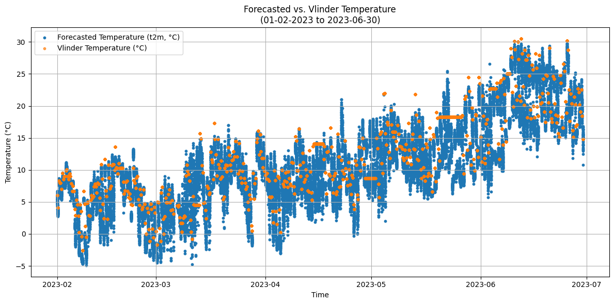

# Weather Forecasting Model: AI Project Documentation

Hello! I'm Kenza, and this is my first academic project in AI — working with time series data! I'm super excited about this journey 😅.

---

## 📋 Project Overview

This project involves training and evaluating multiple machine learning models to improve weather temperature forecasting accuracy. The goal is to correct baseline forecast temperatures using historical data and machine learning techniques.

### Main Components:

1. **Understanding and Visualizing the Data**
2. **Processing the Data**
3. **Training 3 Different ML Models**
4. **Testing our Models**

*Note: There are lots of plots to help visualize the results!*

---

## Part 1: Understanding Data

### Dataset Structure

The forecast data includes predictions for 2023 (February to June):
- **Temporal Range**: February 1, 2023 — June 30, 2023
- **Forecasting Dates**: At least 10 different forecast issuance dates per month
- **Forecast Horizon**: 6 hours to 168 hours (7 days) into the future
- **Data Points per Forecast**: 50 measurements

Each forecast file contains **50 measurements** taken at **3 different forecast hours**, across **8 different days**.


### Why These Months?

The project officially started in March and is scheduled to finish by June. Early data (February onwards) is used for training, while following months are reserved for testing the models' ability to generalize to unseen data.

### Key Variables

- **t2m**: Temperature 2 meters above ground (in Kelvin) - the baseline forecast we aim to improve
- **sp**: Surface pressure
- **msl**: Mean sea level pressure
- **skt**: Skin temperature
- **st**: Soil temperature
- **temp**: Actual observed temperature from the Vlinder weather station

---

## Part 2: Data Processing

### 2.1 Error Metrics for Temperature Measurements

The actual temperature data from the Vlinder station contained some measurement errors:
- **Issue**: Constant temperature values across multiple days indicate equipment malfunction or missing observations
- **Solution**: Identify and remove rows with constant temperature values to prevent bias in model training

### 2.2 Handling Missing Values

**Strategy**:
- Remove rows where the target variable (`temp`) is missing
- Delete columns with >60% missing values or constant zero values
- For remaining missing values in other columns, drop entire columns rather than dropping scattered rows (to preserve temporal continuity)

### 2.3 Normalizing Data

**Normalization Method**: StandardScaler (mean = 0, standard deviation = 1)

**Important Note - Preventing Data Snooping**:
- Data is normalized **after** splitting into training and validation sets
- The scaler is fitted **only on training data**
- The same transformation is applied to validation and test data
- This ensures fair performance evaluation and avoids overfitting

**Excluded from Normalization**:
- Categorical features: `number`, `hour`, `week`, `month`
- Target variable: `temp` (normalized separately for inverse transformation)

### 2.4 Feature Engineering

From the `time` column, we extract:
- **day**: Day of month
- **hour**: Hour of the day (0-23)
- **month**: Month of the year (1-12)
- **week**: ISO calendar week number (used for data splitting)

---

## Part 3: Data Splitting Strategy

**Approach**: Temporal cross-validation by month

For each month:
- **Training Set**: First 3 weeks of the month
- **Validation Set**: Last week of the month

This ensures:
- Training data includes samples from all months
- Validation represents temporally independent periods
- Models are tested on unseen time periods

---

## Part 4: Model Training & Evaluation

### 4.1 Linear Regression with Feature Selection

**Method**: Recursive Feature Elimination with Cross-Validation (RFECV)

**How RFECV Works**:
- Iteratively removes worst-performing features
- Uses 5-fold cross-validation with MAE scoring
- Ranks features by importance
- Identifies the optimal feature subset

**Performance**:
- **MAE (Validation)**: 1.54°C
- **MAE (Training)**: 1.52°C
- **sMAPE (Validation)**: 16%
- **sMAPE (Training)**: 21.3%

**Selected Features**:
- `sp`: Surface pressure
- `msl`: Mean sea level pressure
- `t2m`: Baseline forecasted temperature
- `skt`: Skin temperature
- `st`: Soil temperature

**Interpretation**: The model generalizes well with minimal overfitting. These features make physical sense for temperature prediction.

---

### 4.2 XGBoost (Extreme Gradient Boosting)

**What is XGBoost?**

XGBoost is a highly efficient machine learning library based on gradient boosting:
- Builds an ensemble of decision trees sequentially
- Each new tree corrects errors from previous ones
- Uses parallel processing and tree pruning for efficiency
- Includes L1 and L2 regularization to prevent overfitting
- Handles missing values gracefully
- Widely used in competitions due to superior accuracy on tabular data

**Hyperparameter Tuning**:
- Grid search with 3-fold cross-validation
- Parameters tuned: `n_estimators`, `max_depth`, `learning_rate`, `subsample`

**Performance**:
- **MAE (Validation)**: 1.59°C
- **MAE (Training)**: 1.17°C
- **sMAPE (Validation)**: 19.8%
- **sMAPE (Training)**: 18.3%

**Key Findings**:
- Outperforms linear regression by capturing non-linear relationships
- Top features: `t2m`, `sp`, and `month`
- Month is more important for XGBoost (seasonal temperature variation)
- Minimal overfitting gap between train and validation sets

**Conclusion**: XGBoost delivers robust and accurate forecasts while generalizing well to unseen data.

---

### 4.3 MLPRegressor (Multi-Layer Perceptron)

**What is MLPRegressor?**

A feedforward artificial neural network with:
- Multiple hidden layers between input and output
- Non-linear activation functions (ReLU, tanh)
- Early stopping to prevent overfitting

**Hyperparameter Tuning**:
- Randomized search with 3-fold cross-validation
- 20 iterations testing different configurations
- Parameters: hidden layer sizes, activation functions, regularization strength (alpha)
- Early stopping enabled

**Performance**:
- **MAE (Validation)**: 2.80°C
- **MAE (Training)**: 1.36°C
- **sMAPE (Validation)**: 30.5%
- **sMAPE (Training)**: 19.5%

**Important Note**:
There's a larger gap between training and validation errors, suggesting some overfitting. Additionally, categorical features (`number`, `hour`, `month`, `day`) were not scaled like other features, which may have influenced the model's weight distribution since MLPs are sensitive to feature scales.

**Top Features by Importance**:
- `t2m`: Baseline temperature (most important)
- `month`: Seasonal information
- `hour`: Diurnal temperature cycle
- `day`: Day within month

---

## Part 5: Testing on Unseen Data (2024)

### 5.1 Test Dataset

Independent test data from **February 1 — July 7, 2024** (completely unseen during training)

**Data Preparation**:
- Merge 50 forecasts for each timestamp
- Remove rows with constant (erroneous) temperature values
- Apply same preprocessing as training data
- Normalize using training set scaler

### 5.2 Model Comparison on Test Set

| Metric | Linear Regression | XGBoost | MLPRegressor |
|--------|-------------------|---------|--------------|
| **MAE** | Higher | **Lowest** ✓ | Moderate |
| **sMAPE** | Higher | **Lowest** ✓ | Moderate |

### 5.3 Performance Analysis

**Linear Regression**:
- Generally reasonable but higher errors than complex models
- Tends to underfit
- Too simple to capture weather dynamics

**XGBoost** ⭐:
- Achieves the lowest MAE and sMAPE
- Best captures non-linear relationships and feature interactions
- Generalizes excellently to unseen 2024 data
- **Recommended as primary model**

**MLPRegressor**:
- Performance similar to validation set
- Generally weaker than XGBoost
- More prone to overfitting
- Less interpretable than other models

### 5.4 Temporal Analysis

**February-March 2024**:
- All models outperform baseline t2m
- Linear and XGBoost models are closest to actual temperatures
- MLP tends to deviate more

**May 2024**:
- Linear regression significantly underestimates temperatures for some days
- XGBoost stays close to actual values with minor underestimation
- MLP falls between but still underestimates occasionally
- Generally warmer period exposes model weaknesses more

---

## 📊 Results & Conclusion

### Model Rankings

1. **🥇 XGBoost** - Best overall performance, lowest errors, excellent generalization
2. **🥈 Linear Regression** - Simpler, interpretable, reasonable performance
3. **🥉 MLPRegressor** - Moderate performance, some overfitting tendencies

### Key Insights

✅ **Successes**:
- ML models improve upon naive t2m forecasts
- XGBoost reliably captures temperature dynamics
- Models generalize well to 2024 unseen data
- Feature engineering (hour, month) adds predictive value

⚠️ **Challenges**:
- All models tend to underestimate during warmer months (May-June)
- Seasonal variations (especially winter warming in February) can surprise models
- MLPRegressor requires better feature scaling for optimal performance

### Recommendations for Future Work

1. **Feature Engineering**: Add lagged features, rolling averages, cyclical encoding for time features
2. **Data Quality**: Further investigate and handle Vlinder measurement errors
3. **Ensemble Methods**: Combine predictions from multiple models
4. **Hyperparameter Tuning**: Extended grid search or Bayesian optimization
5. **Seasonal Models**: Separate models for different seasons
6. **Larger Dataset**: Extend training data to multiple years for better generalization

---

## 📁 Project Structure

```
weather-forecasting/
├── Forecast data 2023/          # Training forecasts (Feb-Jun 2023)
├── forecast_2024_02_01_till_2024_06_30_ECMWF/  # Test forecasts (2024)
├── Vlinder 2023/                # Ground truth observations
├── Demo files/                  # Sample data demonstrations
├── forecasts_final.ipynb        # Complete analysis notebook
├── merged_forecast_recent.csv   # Merged training data
└── README.md                    # This file
```

---

## 🔧 Technical Stack

- **Python 3.x**
- **pandas**: Data manipulation and analysis
- **scikit-learn**: Machine learning (preprocessing, models, metrics)
- **XGBoost**: Gradient boosting regression
- **matplotlib**: Data visualization
- **numpy**: Numerical computations

---

## 📝 Files & Data

- **Training Data**: Feb-Jun 2023 forecasts (28 forecast dates × 50 members = 1400 total forecasts)
- **Test Data**: Feb-Jul 2024 forecasts (completely independent)
- **Target Variable**: Vlinder station temperature observations
- **Features**: Meteorological variables from ECMWF forecasts

---

**Thank you for reading! 🙏**

*Final Note: XGBoost is the clear winner — it's the best model for this weather forecasting task.*
=======

#weather-forcasting


In this repository, we forecast temperature based on real-world weather data.

The project includes four main parts:

1- Understanding and visualizing the data

2- Processing the data

3- Training three different machine learning models

4- Testing and evaluating the models


